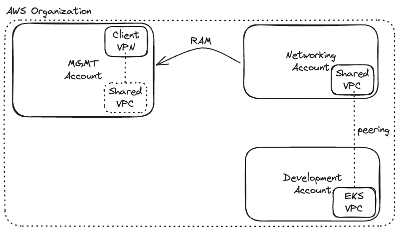
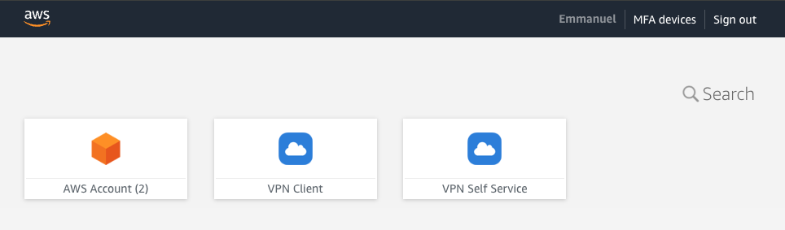
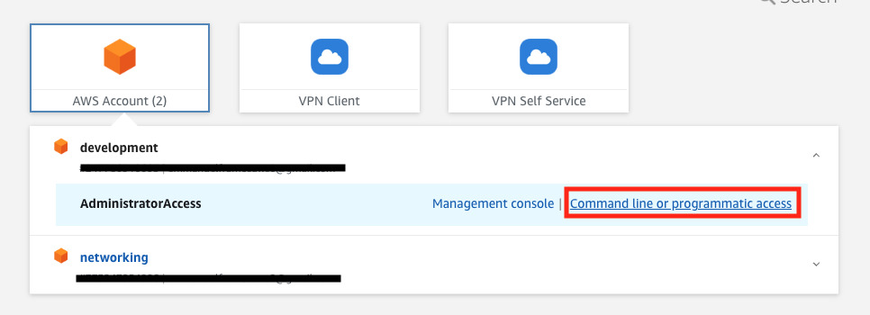
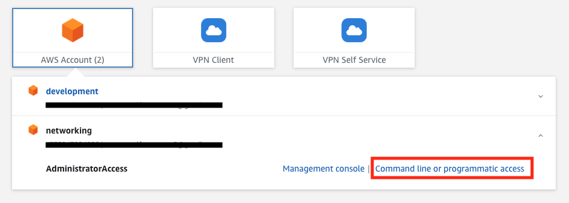

# AWS SSO + Client VPN Endpoint + EKS Cluster

## Steps
1. Configure Users & Accounts
2. VPN & Self-Service Applications Setup
3. Create Development EKS Cluster
4. Create Networking VPC
5. Connection peering between Development & Networking VPCs
6. Share Networking VPC with Management Account via RAM
7. Create Client VPN Endpoint
8. Configure EKS Access



## 1. Configure Users and Accounts
AWS Accounts:
1. Management
2. Networking
3. Development

### AWS SSO
Enable SSO in the Management account.

### Groups/Users and Accounts
Create 2 user groups:
- admins
- developers

Create permission sets for each group:
1. admins - AdministratorAccess
2. developers - DeveloperAccess 

For the developers, make sure to attach the following policy:
```
{
    "Version": "2012-10-17",
    "Statement": [
        {
            "Sid": "VisualEditor0",
            "Effect": "Allow",
            "Action": [
                "eks:List*",
                "eks:Describe*",
                "eks:AccessKubernetesApi"
            ]        
        }
    ]
}
```

Assign groups to accounts:
1. admins - Networking + Development
2. developers - Development

## 2. VPN & Self-Service Applications Setup
Create Client VPN and Self-Service applications and assign groups to both.

Then create the IAM Identity Provider for the both applications.


## 3. Create Development EKS Cluster
Apply the terraform project: **terraform/tf-development** using Development Admin credentials.


## 4. Create Networking VPC
Apply the terraform project: **terraform/tf-networking** using Networking Admin credentials.


## 5. Connection peering between Development & Networking VPCs
**Note:** Peering must be accepted by Development VPC.

The connection peering has been created above, but we need to add new route to the route tables
in Development and Networking Accounts.

**Development Private Route Table:**
```
Target: peering ID
Destination: Shared VPC CIDR
```

**Networking Private Route Table:**
```
Target: peering ID
Destination: Development VPC CIDR
```

## 6. Share Networking VPC with Management Account via RAM
Activate Resources Sharing in the Management Account.

Then, in Networking Account, share the private subnets with Management Account.

Those private subnets will be used in client vpn subnets association.

## 7. Create Client VPN Endpoint
### Server Certificate
Create the CA using **easyrsa**:
```
brew install easy-rsa
easyrsa init-pki
easyrsa build-ca nopass
```

Generate public and private keys:
```
easyrsa build-server-full server nopass
```

Import the generated files to AWS ACM:
```
Certificate Body - issued/server.crt
Certificate Private Key - private/server.key
Certificate Chain - ca.crt
```

Or using **awscli**:
```
aws acm import-certificate \
    --certificate fileb://issued/server.crt \
    --private-key fileb://private/server.key \
    --certificate-chain fileb://ca.crt
```

### Creating the Client VPN Endpoint
Create the client VPN endpoint using the params below:

**Name tag:** client-vpn <br>
**Description:** Something useful that describes your VPN Client Endpoint. <br>
**Client IPv4 CIDR:** 100.100.0.0/22 (Cannot overlap with target VPC) <br>
**Server certificate ARN:** Your ACM Certificate <br>
**Authentication Options:** User-based authentication -> Federated authentication <br>
**SAML provider ARN:** Use the IAM Identity Provider (VPN) ARN created earlier <br>
**Self-Service provider ARN:** Use the IAM Identity Provider (Self-Service) ARN created earlier <br>
**Enable connection log:** Yes -> Create CloudWatch Log Group <br>
**Enable Client Connect Handler:** No <br>
**DNS Server 1 IP address:** 1.1.1.1 <br>
**DNS Server 2 IP address:** 1.0.0.1 <br>
**Transport Protocol:** UDP <br>
**Enable split-tunnel:** Yes <br>
**VPC ID:** Must contain the Security Group <br>
**Security Group IDs:** Create the security group allowing port 443 <br>
**VPN Port:** 443 <br>
**Enable Self-service portal:** Yes <br>

Create the Authorization Rules:
```  
Group (admins) - Destination (10.0.0.0/16) net vpc
Group (devs) - Destination (10.0.0.0/16) net vpc

Group (admins) - Destination (192.168.0.0/16) dev vpc
Group (devs) - Destination (192.168.0.0/16) dev vpc
```

Create the Route Tables:
```
Target (private subnet 1) - Destination (10.0.0.0/16)
Target (private subnet 2) - Destination (10.0.0.0/16)

Target (private subnet 1) - Destination (192.168.0.0/16)
Target (private subnet 2) - Destination (192.168.0.0/16)
```

**Note:** In Client VPN details, copy the Self-Service portal URL and
paste it to Self-Service Application Start URL (Identity Center).


## 8. Configure EKS Access
Add a new security group rule to EKS Cluster SG:
```
Inbound -> HTTPS -> 10.0.0.0/16 (Networking VPC)
```

Checking the cluster creator on **CloudWatch Log Insights**:
```
fields @logstream, @timestamp, @message
| sort @timestamp desc
| filter @logStream like /kube-apiserver/
| filter @message like "kubernetes-admin"
| limit 50
```

Run the script below to configure your kubectl to access the EKS Cluster:
```
aws eks update-kubeconfig --region us-east-1 --name eks-demo
```

**Note:** Make sure of using Development Admin credentials.

To create the developer cluster role, apply the **k8s/clusterRole-developer.yaml** file.

To add a developer user, run the script **k8s/eksctl-add-dev-user.sh** (replace values)


## Links:
**EKS Configmap AWS Auth:** https://github.com/aws-samples/eks-aws-auth-configmap <br>
**Troubleshooting EKS Auth Error:** https://repost.aws/knowledge-center/eks-api-server-unauthorized-error


